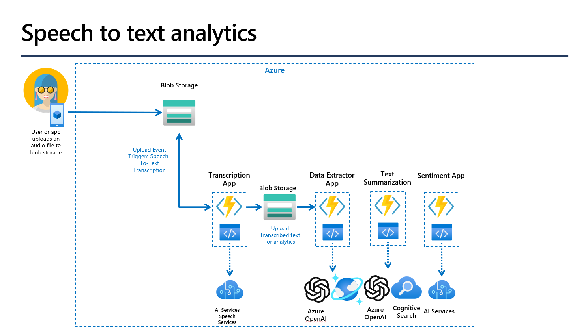

# Call Center LLM Demo

Azure Cognitive Services using Speech Services and Azure OpenAI.  This is a demo repo showing a path to creating an event driven/http triggered workflow for processing audio files (call center recordings) to generate structured data (e.g. JSON) from unstructured conversations.  We will show how to start the workflow by:
- save an audio files (.wav, .mp3 etc.) to a blob storage account
- trigger an Azure Function that will use Azure Cognitive SpeechServices to generate transcribed text from the audio files
- save the transcribed conversation to a blob storage acccount
- trigger an LLM to extract important information from the transcribbed text (unstructured data) and output a structured data format (e.g. JSON) with pertinent information
- trigger sentiment analysis on the transcribbed text
- generate and save summarized information on the conversation
- be able to perform additional analysis on the transcribed information for future purposes

## Deploy

- Using the Azure Developer CLI

## Application Diagram

